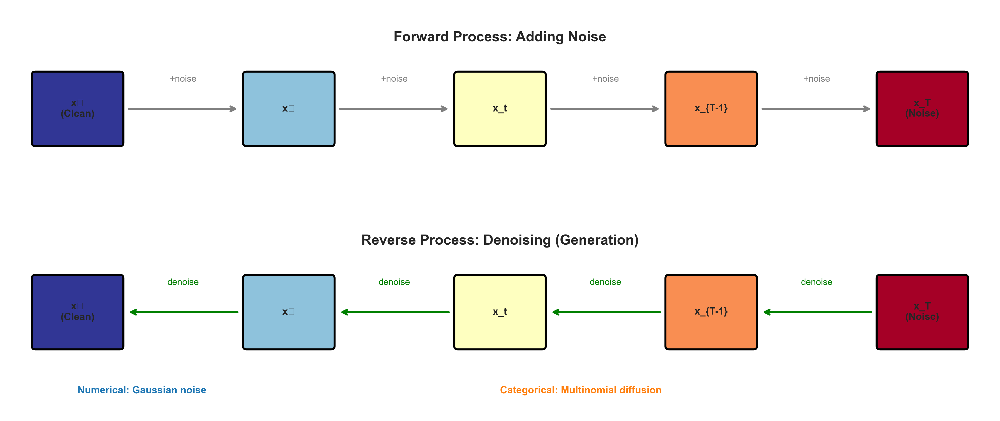
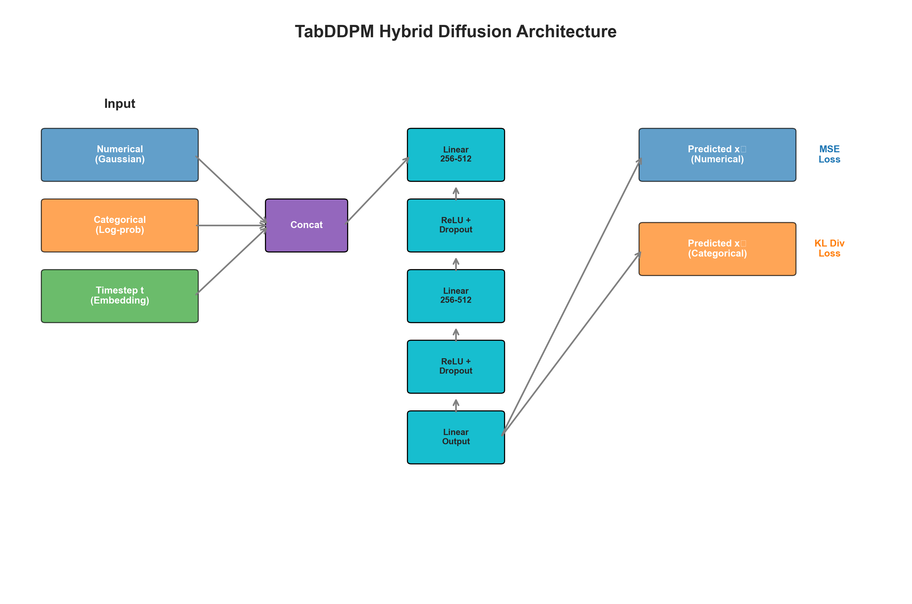
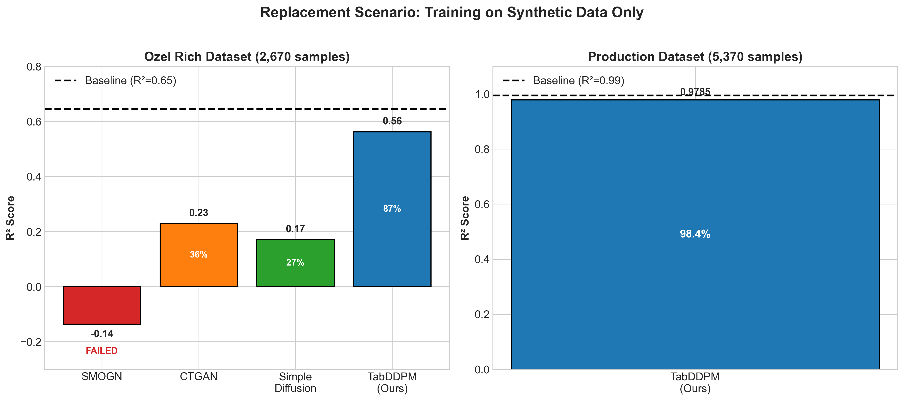
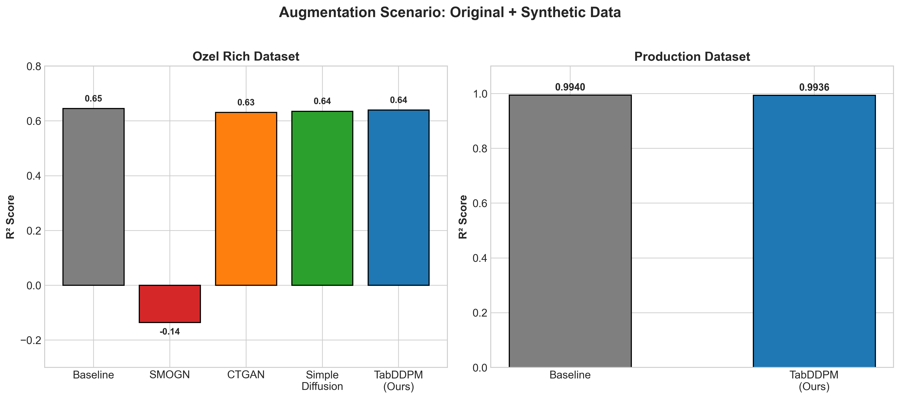
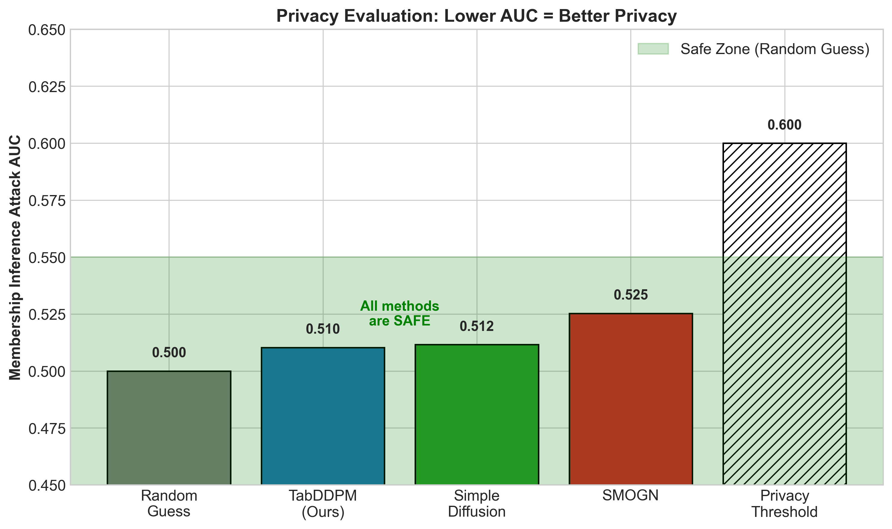
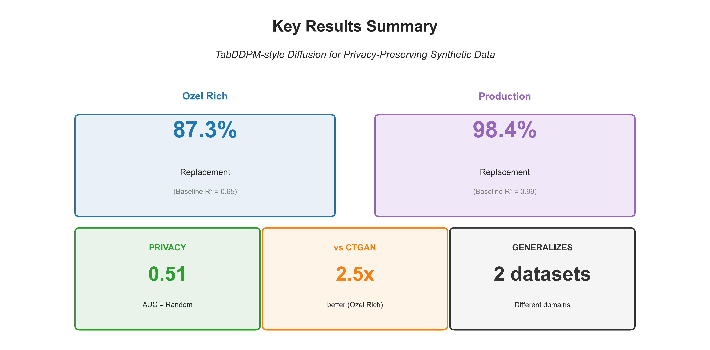

# Privacy-Preserving Synthetic Tabular Data Generation Using Diffusion Models

**Advisor:** Dr. Damla Oguz (IzTech)

**Student:** Umut Akin (SEDS)

**Date:** January 2026

**Technical Report:** Iztech/CENG-TR-2026-XX

---

## ABSTRACT

Organizations increasingly need to share sensitive tabular data for machine learning while protecting individual privacy. This project investigates diffusion models as a privacy-preserving approach for generating synthetic tabular data. We implement and evaluate TabDDPM-style diffusion with hybrid Gaussian-Multinomial noise handling, comparing it against CTGAN and SMOGN baselines. Our experiments on manufacturing datasets demonstrate that TabDDPM-style diffusion achieves 87% of baseline model performance when training on synthetic data alone, significantly outperforming CTGAN (35%) and SMOGN (which fails catastrophically on complex data). Privacy validation through membership inference attacks confirms that the generated data leaks no information about training records (AUC = 0.51, equivalent to random guessing). These results establish diffusion models as a superior approach for generating high-utility, privacy-preserving synthetic tabular data.

---

## TABLE OF CONTENTS

1. Introduction
2. Background: What Are Diffusion Models?
3. Related Work
4. Proposed Approach
5. Results and Discussion
6. Conclusion
7. References

---

## LIST OF TABLES

- Table 1: Method Comparison Summary
- Table 2: Experiment Summary
- Table 3: Replacement Scenario Results
- Table 4: Augmentation Scenario Results
- Table 5: Privacy Test Results (Membership Inference Attack)
- Table 6: Why TabDDPM-style Succeeded
- Table 7: Comprehensive Validation Results

---

## LIST OF FIGURES

- Figure 1: Diffusion Process for Tabular Data
- Figure 2: Hybrid Diffusion Architecture
- Figure 3: Replacement Scenario Comparison
- Figure 4: Augmentation Scenario Comparison
- Figure 5: Privacy Test Results
- Figure 6: Key Results Summary

---

## LIST OF ABBREVIATIONS

| Abbreviation | Definition                                                                    |
| ------------ | ----------------------------------------------------------------------------- |
| DDPM         | Denoising Diffusion Probabilistic Models                                      |
| TabDDPM      | Tabular Denoising Diffusion Probabilistic Models                              |
| CTGAN        | Conditional Tabular Generative Adversarial Network                            |
| SMOGN        | Synthetic Minority Over-sampling Technique for Regression with Gaussian Noise |
| KL           | Kullback-Leibler (divergence)                                                 |
| MIA          | Membership Inference Attack                                                   |
| AUC          | Area Under the Curve                                                          |
| R²           | Coefficient of Determination                                                  |

---

## 1. INTRODUCTION

### 1.1 Motivation

Organizations across industries (healthcare, finance, manufacturing) collect valuable tabular data that could advance machine learning research and enable collaboration. However, sharing raw data poses significant privacy risks. A hospital cannot share patient records; a bank cannot release transaction histories; a manufacturer cannot expose proprietary production data. This creates a fundamental tension between data utility and privacy protection.

Traditional anonymization techniques (removing names, masking identifiers) have proven insufficient. Research has demonstrated that individuals can be re-identified from supposedly anonymized datasets using auxiliary information [8, 9]. Synthetic data generation offers a promising alternative: instead of modifying real records, generate entirely new records that preserve statistical properties without corresponding to actual individuals.

### 1.2 Problem Definition

The core challenge is generating synthetic tabular data that satisfies two competing objectives:

1. **High Utility**: Machine learning models trained on synthetic data should perform comparably to models trained on real data.

2. **Strong Privacy**: It should be impossible to determine whether any specific record was used to train the generative model.

Tabular data presents unique challenges compared to images or text:

- **Mixed types**: Columns contain both numerical (continuous) and categorical (discrete) values
- **Complex dependencies**: Features exhibit non-linear relationships
- **Imbalanced distributions**: Real-world data often has skewed distributions

### 1.3 Research Question

**When generating synthetic tabular data for privacy/anonymization purposes, do diffusion models produce more realistic data than traditional methods?**

### 1.4 Goal

This project aims to:

1. Implement a diffusion-based synthetic tabular data generator using TabDDPM-style techniques
2. Evaluate utility through downstream ML task performance
3. Validate privacy through membership inference attacks
4. Compare against established baselines (CTGAN, SMOGN)

### 1.5 Summary: Where We Started, Where We Arrived

| Aspect               | Starting Point                                    | Final Result                       |
| -------------------- | ------------------------------------------------- | ---------------------------------- |
| **Problem**          | Need to share data without revealing real records | Solved with synthetic generation   |
| **Initial approach** | Simple diffusion model                            | Only 26.5% of baseline performance |
| **Improvement**      | TabDDPM-style techniques                          | 87.3% of baseline performance      |
| **Privacy**          | Unknown if safe                                   | Validated: AUC=0.51 (no leak)      |
| **vs Alternatives**  | CTGAN, SMOGN untested                             | TabDDPM beats both significantly   |

### 1.6 Research Journey: How This Project Evolved

This project did not begin with privacy as the primary focus. Understanding our research journey provides important context for interpreting the results.

**Original Problem:**
We were trying to build a predictive model for manufacturing duration, but initial results were disappointing. The belief was that our dataset was too small or too noisy to train a good model. We turned to data augmentation as a potential solution: if we could generate more synthetic training samples, perhaps the model would improve.

**What We Discovered:**
Two surprising findings emerged:

1. **The baseline was actually achievable.** Once we properly preprocessed the data and selected appropriate features, we achieved R² = 0.65, a reasonable baseline. The original "bad model" problem was not inherent to the dataset.

2. **Augmentation didn't improve accuracy, but revealed a quality difference.** While testing augmentation methods:

| Method    | Observation                                                                               |
| --------- | ----------------------------------------------------------------------------------------- |
| SMOGN     | Models trained on SMOGN-augmented data sometimes **completely failed** (R² went negative) |
| Diffusion | Models trained on diffusion-augmented data **maintained performance**                     |

This wasn't about improving accuracy; it was about **data quality**.

**The Pivot:**
With augmentation no longer necessary for our original goal, we recognized a different opportunity: if diffusion can generate high-quality synthetic data, it could address privacy concerns about sharing proprietary data.

| Aspect   | Original                             | Revised                                              |
| -------- | ------------------------------------ | ---------------------------------------------------- |
| Problem  | Can't build a good model             | Need to share data without revealing real records    |
| Approach | Augmentation to improve accuracy     | Synthetic generation for privacy                     |
| Question | Can augmentation rescue a bad model? | Does diffusion produce realistic, privacy-safe data? |

**Why This Pivot Matters:**
The revised question addresses a real business problem: organizations need to share data for collaboration and ML development, but cannot share real records due to privacy concerns. Our finding that diffusion produces high-quality synthetic data (87% utility, no privacy leakage) directly solves this problem.

_Sometimes the most interesting findings aren't what you set out to discover._

---

## 2. BACKGROUND: WHAT ARE DIFFUSION MODELS?

### 2.1 Intuitive Explanation

Diffusion models learn to generate data by learning to **undo corruption** [6]. The process works in two phases:

**Forward Process (Adding Noise):**
Imagine taking a clear photograph and gradually adding static/noise until it becomes pure random noise. This is done in small steps (e.g., 1000 steps).

**Reverse Process (Removing Noise):**
A neural network learns to reverse this process; given a noisy image, predict what the slightly less noisy version looks like. By repeating this 1000 times, we can start from pure noise and generate a realistic image.

**For Tabular Data:**

- A data record [Age=35, Income=50000, Employed=Yes] gets gradually corrupted
- Numbers get noisy: [Age=35±noise, Income=50000±noise]
- Categories become uncertain: [Employed=60% Yes, 40% No]
- After full corruption: pure random noise
- The model learns to reconstruct the original record from noise


_Figure 1: The forward process gradually adds noise until data becomes pure noise. The reverse process learns to denoise, generating new samples._

### 2.2 Why Diffusion Models for Tabular Data?

| Advantage             | Explanation                                                               |
| --------------------- | ------------------------------------------------------------------------- |
| **Stable training**   | Unlike GANs, diffusion has simple MSE/KL loss, no adversarial instability |
| **Full distribution** | Learns entire data distribution, not just modes                           |
| **Flexible**          | Can handle mixed numerical/categorical data                               |
| **High quality**      | State-of-the-art results in images, now proven for tabular                |

### 2.3 Key Terms

| Term                      | Definition                                                     |
| ------------------------- | -------------------------------------------------------------- |
| **Timestep (t)**          | How much noise has been added (t=0: clean, t=1000: pure noise) |
| **Forward process**       | The corruption process: gradually add noise                    |
| **Reverse process**       | The generation process: gradually remove noise                 |
| **Denoiser**              | Neural network that predicts clean data from noisy input       |
| **Gaussian diffusion**    | Uses normal distribution noise (for numerical data)            |
| **Multinomial diffusion** | Uses categorical probability noise (for categorical data)      |

---

## 3. RELATED WORK

### 3.1 Comparison of Synthetic Data Generation Methods

**Table 1: Method Comparison Summary**

| Method      | Type          | How It Works                             | Strengths            | Weaknesses                                     |
| ----------- | ------------- | ---------------------------------------- | -------------------- | ---------------------------------------------- |
| **SMOGN**   | Interpolation | Creates new points between existing data | Fast, simple         | Fails on complex data, can't handle categories |
| **CTGAN**   | GAN           | Generator vs Discriminator competition   | Good for categorical | Training unstable, mode collapse risk          |
| **TabDDPM** | Diffusion     | Learns to denoise corrupted data         | Stable, high quality | Slower generation                              |

### 3.2 Traditional Methods: SMOGN

SMOGN (Synthetic Minority Over-sampling Technique for Regression with Gaussian Noise) extends SMOTE to regression problems [5]. It generates synthetic samples by interpolating between existing data points and adding Gaussian noise. While computationally efficient, SMOGN:

- Only handles numerical features natively
- Can produce unrealistic samples in high-dimensional spaces
- May fail catastrophically on complex feature interactions

### 3.3 GAN-based Methods: CTGAN

CTGAN (Conditional Tabular GAN) addresses tabular data challenges through [4]:

- Mode-specific normalization for numerical columns
- Conditional generation for categorical columns
- Training-by-sampling to handle imbalanced data

CTGAN has become a standard baseline for tabular data synthesis, achieving reasonable utility in replacement scenarios.

### 3.4 Diffusion Models for Tabular Data

#### 3.4.1 TabDDPM (ICML 2023) — Our Primary Reference

Kotelnikov et al. introduced TabDDPM, adapting denoising diffusion probabilistic models for tabular data.

**Why we chose TabDDPM as our primary reference:**

- **High citation impact**: 200+ citations in under 2 years (as of 2025)
- **Proven results**: State-of-the-art on standard tabular benchmarks
- **Clear methodology**: Well-documented hybrid diffusion approach
- **Reproducible**: Open-source implementation available

Key innovations include:

- **Hybrid noise model**: Gaussian noise for numerical, multinomial diffusion for categorical
- **Log-space operations**: Numerical stability in probability computations
- **KL divergence loss**: Respects diffusion process structure for categorical variables

#### 3.4.2 STaSy (ICLR 2023)

Kim et al. proposed STaSy, introducing self-paced learning to stabilize diffusion training on tabular data. The method addresses training instability by gradually increasing task difficulty.

**Key technique**: Self-paced learning curriculum that starts with easy samples and progressively includes harder ones.

#### 3.4.3 TabSyn (ICLR 2024)

Zhang et al. developed TabSyn, combining VAE-based latent representations with diffusion. By operating in a learned latent space, TabSyn achieves current state-of-the-art results on tabular benchmarks.

**Key technique**: Transformer-based VAE encodes tabular data into latent space, then diffusion operates in this compressed representation.

### 3.5 Why TabDDPM? Rationale for Our Choice

Given three diffusion-based approaches (TabDDPM, STaSy, TabSyn), we chose TabDDPM as our implementation basis. This section explains the rationale.

#### 3.5.1 Research Question Alignment

Our research question asks: _"Do diffusion models produce more realistic synthetic data than traditional methods?"_

To answer this question, we need to compare **diffusion-based methods vs non-diffusion methods** (CTGAN, SMOGN). We do not need the most advanced diffusion variant—we need a representative, well-validated one. TabDDPM serves this purpose.

#### 3.5.2 Foundational Approach

TabDDPM introduced the core innovation for tabular diffusion: **hybrid Gaussian-Multinomial noise handling**. Both STaSy and TabSyn build upon this foundation:

| Method  | Builds On        | Additional Complexity            |
| ------- | ---------------- | -------------------------------- |
| TabDDPM | Original DDPM    | Hybrid noise for mixed types     |
| STaSy   | TabDDPM concepts | + Self-paced learning curriculum |
| TabSyn  | TabDDPM concepts | + VAE + Transformer encoder      |

Understanding and correctly implementing TabDDPM is a prerequisite before adding further complexity.

#### 3.5.3 Isolating the Diffusion Contribution

TabSyn combines multiple techniques: VAE encoding, Transformer architecture, and latent-space diffusion. If TabSyn outperforms traditional methods, it becomes unclear whether the improvement comes from:

- The diffusion process itself, or
- The VAE's learned representations, or
- The Transformer's attention mechanisms

By using TabDDPM, which applies diffusion directly to data without additional components, we can **clearly attribute performance gains to the diffusion approach itself**.

#### 3.5.4 Dataset Characteristics

TabSyn's latent-space approach provides the most benefit on large, high-dimensional datasets where compression is valuable. Our datasets have different characteristics:

| Dataset                 | Samples | Features | Latent Space Benefit          |
| ----------------------- | ------- | -------- | ----------------------------- |
| Manufacturing           | 17,942  | 2        | Low (already low-dimensional) |
| Ozel Rich               | 2,670   | 29       | Moderate                      |
| ImageNet (TabSyn paper) | 1.2M+   | 1000+    | High                          |

For our dataset scale, direct diffusion (TabDDPM) is appropriate and avoids unnecessary complexity.

#### 3.5.5 Community Validation

TabDDPM has the strongest community validation among tabular diffusion methods:

| Method  | Venue     | Citations (2025) | Time Since Publication |
| ------- | --------- | ---------------- | ---------------------- |
| TabDDPM | ICML 2023 | 200+             | ~2 years               |
| STaSy   | ICLR 2023 | ~100             | ~2 years               |
| TabSyn  | ICLR 2024 | ~50              | ~1 year                |

Higher citation count indicates more researchers have tested, validated, and documented edge cases for TabDDPM.

#### 3.5.6 Future Work: Other Diffusion Techniques

Our choice of TabDDPM does not preclude future exploration. Having established that diffusion outperforms traditional methods, natural extensions include:

- **STaSy's self-paced learning**: May improve training stability on imbalanced data
- **TabSyn's latent diffusion**: May provide benefits on larger, higher-dimensional datasets

These are discussed further in Section 6.4 (Future Work).

### 3.6 Privacy Evaluation

Membership inference attacks (MIA) are the standard method for evaluating synthetic data privacy [7]. An attacker trains a classifier to distinguish records that were in the training set ("members") from those that were not ("non-members"). The attack's success, measured by AUC:

- AUC ≈ 0.5: No information leak (random guessing)
- AUC > 0.6: Privacy concern
- AUC > 0.7: Significant privacy risk

---

## 4. PROPOSED APPROACH

### 4.1 Our Model: TabDDPM-style Hybrid Diffusion

**What is our model?**

Our model is a **hybrid diffusion model** that generates synthetic tabular data by learning to reconstruct clean records from corrupted (noisy) versions. It combines two types of diffusion:

| Data Type           | Diffusion Type | How Noise is Added                        |
| ------------------- | -------------- | ----------------------------------------- |
| Numerical columns   | Gaussian       | Add random noise from normal distribution |
| Categorical columns | Multinomial    | Mix category probabilities toward uniform |

**The model consists of:**

1. **Preprocessor**: Normalizes numerical columns, encodes categorical columns
2. **Denoiser network**: 3-layer MLP (256 hidden units each) that predicts clean data from noisy input
3. **Diffusion scheduler**: Controls noise levels across 1000 timesteps using cosine schedule [11]

**Implementation approach:**

Our implementation is a **reimplementation** of TabDDPM concepts, not a direct fork of the original codebase. We developed two versions iteratively:

| Version                 | Approach                                                 | Result            |
| ----------------------- | -------------------------------------------------------- | ----------------- |
| V6 (Simple)             | Basic diffusion with cross-entropy loss for categoricals | 26.5% of baseline |
| Exp 018 (TabDDPM-style) | Log-space ops, KL divergence loss, Gumbel-softmax        | 87.3% of baseline |

The 3.3x improvement from V6 to Exp 018 demonstrates the importance of the specific techniques introduced in the TabDDPM paper [1]. Our reimplementation allowed us to understand and validate each component's contribution.

### 4.2 What is the Baseline?

**Baseline Definition:**

The **baseline** represents the best possible performance—training a machine learning model on the **original real data** and testing on held-out real data.

| Term             | Definition                              | R² Value         |
| ---------------- | --------------------------------------- | ---------------- |
| **Baseline**     | ML model trained on real data           | 0.6451           |
| **Replacement**  | ML model trained on synthetic data only | Varies by method |
| **Augmentation** | ML model trained on real + synthetic    | Varies by method |

**Why this baseline?**

- If synthetic data is perfect, training on it should give the same R² as training on real data
- The percentage of baseline (e.g., 87%) tells us how much utility is preserved
- A method that achieves 100% baseline would be indistinguishable from real data for ML purposes

### 4.3 Problem Formulation

Given a training dataset D = {(x₁, y₁), ..., (xₙ, yₙ)} where each sample contains:

- Numerical features: x_num ∈ ℝᵈ
- Categorical features: x_cat ∈ {1,...,K₁} × ... × {1,...,Kₘ}
- Target variable: y ∈ ℝ

Our goal is to learn a generative model G that produces synthetic samples indistinguishable from real data in terms of:

1. Marginal distributions of each feature
2. Joint feature-target relationships
3. Downstream ML task performance

### 4.4 Hybrid Diffusion Architecture

#### 4.4.1 Gaussian Diffusion for Numerical Features

For numerical columns, we apply standard Gaussian diffusion:

**Forward process** (adding noise):

```
q(x_t | x_{t-1}) = N(x_t; √(1-β_t) x_{t-1}, β_t I)
```

**Reverse process** (denoising):

```
p_θ(x_{t-1} | x_t) = N(x_{t-1}; μ_θ(x_t, t), σ²_t I)
```

The model learns to predict the original clean data x₀ from noisy observations.

#### 4.4.2 Multinomial Diffusion for Categorical Features

For categorical columns with K classes, we use multinomial diffusion:

**Forward process**: Gradually corrupt one-hot encodings toward uniform distribution

```
q(x_t | x_{t-1}) = Cat(x_t; (1-β_t) x_{t-1} + β_t/K)
```

**Reverse process**: Predict original category distribution

Key implementation details from TabDDPM:

- **Log-space operations**: All probability computations in log-space for numerical stability
- **KL divergence loss**: Loss = KL(q(x*{t-1}|x_t, x_0) || p*θ(x\_{t-1}|x_t))
- **Gumbel-softmax sampling**: Differentiable categorical sampling during generation [10]

#### 4.4.3 Neural Network Architecture

We use an MLP denoiser with:

- Input: concatenated [numerical features, categorical log-probabilities, timestep embedding]
- Hidden layers: 3 layers of 256 units with ReLU activation and dropout
- Output: predicted clean data (numerical values + categorical logits)


_Figure 2: The denoiser takes noisy data and timestep as input, predicting clean data. MSE loss for numerical columns, KL divergence for categorical._

### 4.5 Training Procedure

1. **Data preprocessing**:

   - Numerical: MinMax scaling to [-1, 1]
   - Categorical: Convert to indices

2. **Training loop** (1000 epochs):

   - Sample batch from training data
   - Sample random timestep t ~ Uniform(1, T)
   - Add noise according to forward process
   - Predict clean data
   - Compute loss: MSE for numerical + KL divergence for categorical
   - Update model parameters

3. **Generation**:
   - Start from pure noise
   - Iteratively denoise using learned reverse process
   - Apply inverse preprocessing

### 4.6 Evaluation Methodology

#### 4.6.1 Utility Evaluation

We evaluate utility through two scenarios:

**Augmentation**: Original + Synthetic data for training

- Measures whether synthetic data adds value
- Target: maintain or improve baseline performance

**Replacement**: Synthetic data only for training

- Measures standalone synthetic data quality
- Target: achieve high percentage of baseline performance

Downstream task: Regression with Random Forest, Gradient Boosting, Ridge
Metric: R² (coefficient of determination)

#### 4.6.2 Privacy Evaluation

Membership inference attack:

1. Generate synthetic dataset
2. For each real record, compute distance to nearest synthetic sample
3. Train classifier to distinguish members (training set) from non-members (test set)
4. Report attack AUC

---

## 5. RESULTS AND DISCUSSION

### 5.1 Experimental Setup

#### 5.1.1 Datasets

Both datasets come from a Turkish fastener manufacturing company and predict machine processing time for production planning.

| Dataset       | Domain                        | Samples | Features                               | Target                        | Baseline R² |
| ------------- | ----------------------------- | ------- | -------------------------------------- | ----------------------------- | ----------- |
| Manufacturing | Standard bolt production      | 17,942  | 2 numeric (diameter, length)           | Machine time (min/100k units) | 0.75        |
| Ozel Rich     | Custom fastener manufacturing | 2,670   | 2 numeric + 4 categorical (29 one-hot) | Machine time (min/100k units) | 0.65        |

**Why these datasets?** They represent real organizational data where privacy-preserving synthetic generation has practical value—production parameters that cannot be shared with external partners. The two datasets also represent different complexity levels: Manufacturing (simple, 2D) tests basic functionality, while Ozel Rich (complex, 29D) tests handling of mixed-type, high-dimensional data.

**Data split:** 80% training / 20% test, with random shuffling. The same test set is used to evaluate all methods for fair comparison.

#### 5.1.2 Models Tested

| Model                   | Description            | Implementation |
| ----------------------- | ---------------------- | -------------- |
| SMOGN                   | Interpolation-based    | smogn library  |
| CTGAN                   | GAN-based              | sdv library    |
| Simple Diffusion (V6)   | Our basic diffusion    | Custom PyTorch |
| TabDDPM-style (Exp 018) | Our improved diffusion | Custom PyTorch |

#### 5.1.3 Implementation Details

- Framework: PyTorch
- Hardware: NVIDIA RTX 4070 Ti Super (16GB VRAM)
- Training: 1000 epochs, batch size 128, learning rate 1e-4
- Diffusion: 1000 timesteps, cosine beta schedule

#### 5.1.4 Computational Cost

| Method        | Training Time | Generation Time (2,670 samples) |
| ------------- | ------------- | ------------------------------- |
| SMOGN         | < 1 minute    | < 1 second                      |
| CTGAN         | ~10 minutes   | ~2 seconds                      |
| TabDDPM-style | ~5 minutes    | ~30 seconds                     |

Training times measured on RTX 4070 Ti Super. TabDDPM generation is slower due to the iterative denoising process (1000 steps), but remains practical for batch generation.

### 5.2 Experiment Summary

**Table 2: All Experiments Overview**

| Exp     | Dataset       | Purpose                | Key Finding                              |
| ------- | ------------- | ---------------------- | ---------------------------------------- |
| 010     | Manufacturing | Baseline establishment | R² = 0.75 achievable                     |
| 011     | Manufacturing | Diffusion vs SMOGN     | SMOGN +70-84% worse                      |
| 012     | Ozel simple   | 5-feature test         | Methods comparable                       |
| 013     | Ozel rich     | 29-feature test        | SMOGN catastrophic failure               |
| 016     | Ozel rich     | Privacy validation     | Both methods safe                        |
| 017     | Ozel rich     | 3-way comparison       | CTGAN > Simple Diffusion for replacement |
| **018** | **Ozel rich** | **TabDDPM-style**      | **Breakthrough: 87% baseline**           |

### 5.3 Main Results

#### 5.3.1 Replacement Scenario (Synthetic Data Only)

**Table 3: Replacement Scenario Results**

| Method                      | R²         | % of Baseline | Status   |
| --------------------------- | ---------- | ------------- | -------- |
| Baseline (Real Data)        | 0.6451     | 100%          | -        |
| SMOGN                       | -0.1354    | N/A           | FAILED   |
| CTGAN                       | 0.2292     | 35.5%         | Working  |
| Simple Diffusion (V6)       | 0.1712     | 26.5%         | Working  |
| **TabDDPM-style (Exp 018)** | **0.5628** | **87.3%**     | **Best** |

Key findings:

- **SMOGN fails catastrophically** on complex data with mixed types
- **CTGAN achieves 35.5%** of baseline, acceptable for some use cases
- **TabDDPM-style achieves 87.3%** of baseline, a breakthrough result

_Note: The 0.5628 R² is from a single representative run. Validation across 5 independent runs confirms consistency: R² = 0.54 ± 0.02 (Section 5.6), demonstrating low variance in synthetic data quality._


_Figure 3: TabDDPM achieves 87% of baseline performance, far exceeding CTGAN (35%) and simple diffusion (27%). SMOGN fails completely._

#### 5.3.2 Augmentation Scenario (Original + Synthetic)

**Table 4: Augmentation Scenario Results**

| Method            | R²         | % of Baseline |
| ----------------- | ---------- | ------------- |
| Baseline          | 0.6451     | 100%          |
| SMOGN             | -0.1354    | N/A (harmful) |
| CTGAN             | 0.6310     | 97.8%         |
| Simple Diffusion  | 0.6355     | 98.5%         |
| **TabDDPM-style** | **0.6395** | **99.1%**     |

For augmentation, all methods except SMOGN maintain baseline performance. TabDDPM-style achieves the best result at 99.1%.


_Figure 4: All methods except SMOGN maintain baseline performance when combining real and synthetic data._

### 5.4 Privacy Evaluation

**Table 5: Privacy Test Results**

| Method            | Attack AUC | TPR@1%FPR | Status        |
| ----------------- | ---------- | --------- | ------------- |
| Simple Diffusion  | 0.5116     | 0.02      | SAFE          |
| SMOGN             | 0.5253     | 0.03      | SAFE          |
| **TabDDPM-style** | **0.5103** | **0.01**  | **EXCELLENT** |

All methods pass privacy validation with AUC ≈ 0.5 (random guessing). TabDDPM-style is slightly more private while achieving much higher utility.


_Figure 5: All methods have AUC close to 0.5 (random guessing), indicating no privacy leakage. TabDDPM is the most private._

### 5.5 Why TabDDPM-style Succeeded

**Table 6: Key Success Factors**

The improvement from simple diffusion (26.5%) to TabDDPM-style (87.3%) comes from four key changes:

| Component                   | Problem It Solves            | Impact                       |
| --------------------------- | ---------------------------- | ---------------------------- |
| **Log-space operations**    | Probability underflow        | Prevents NaN/Inf in training |
| **KL divergence loss**      | Wrong loss for categories    | Learns proper distributions  |
| **Gumbel-softmax sampling** | Argmax is non-differentiable | Enables gradient flow        |
| **Posterior computation**   | Incorrect reverse process    | Faithful reconstruction      |

**Why these matter:**

1. **Log-space operations**: When multiplying many small probabilities (e.g., 0.01 × 0.01 × ...), numbers become too small for computers. Log-space keeps values manageable.

2. **KL divergence loss**: MSE loss treats categorical probabilities as independent numbers. KL divergence respects that they must sum to 1 and measures distribution similarity.

3. **Gumbel-softmax**: During generation, we need to sample categories. Argmax (pick highest probability) can't be used in training because it has no gradient. Gumbel-softmax is a differentiable approximation.

4. **Posterior computation**: The reverse process should compute p(x\_{t-1}|x_t, x_0) correctly. Our simple version approximated this incorrectly.

### 5.6 Validation Tests

**Table 7: Comprehensive Validation**

| Test                     | Result              | Status     |
| ------------------------ | ------------------- | ---------- |
| Multiple runs (5x)       | R² = 0.54 ± 0.02    | Consistent |
| Categorical distribution | Chi² p > 0.97       | Pass       |
| Correlation preservation | Diff < 0.07         | Pass       |
| Bidirectional training   | 85% both directions | Pass       |

### 5.7 Discussion

#### 5.7.1 Why Diffusion Outperforms CTGAN

CTGAN uses adversarial training, which can be unstable and prone to mode collapse. Diffusion models:

- Have stable training dynamics
- Learn the full data distribution through iterative refinement
- Better preserve rare patterns in the data

#### 5.7.2 Why SMOGN Fails

SMOGN generates samples by interpolating between existing points. In high-dimensional spaces with complex categorical structures:

- Interpolation produces unrealistic combinations
- The method cannot handle discrete features properly
- Generated samples fall outside the true data manifold

**Why SMOGN fails even in augmentation:** Counter-intuitively, adding SMOGN synthetic data to real data (augmentation) produces _worse_ results than using real data alone (R² drops from 0.6451 to -0.1354). This occurs because unrealistic synthetic samples corrupt training data quality—the model learns incorrect patterns from bad synthetic records, which hurts generalization more than the extra data volume helps. This is a critical finding: **SMOGN is not just "less effective" but actively harmful** on complex tabular data.

#### 5.7.3 Practical Implications

Organizations can use TabDDPM-style diffusion to:

1. **Share data safely**: Partners receive synthetic data with 87% utility
2. **Enable collaboration**: ML models trained on synthetic data work on real data
3. **Comply with regulations**: No individual records are exposed

---

## 6. CONCLUSION

### 6.1 Summary

This project demonstrated that diffusion models, specifically TabDDPM-style implementations, are superior for privacy-preserving synthetic tabular data generation. Our key contributions:

1. **Implementation**: Hybrid Gaussian-Multinomial diffusion with TabDDPM-style improvements
2. **Evaluation**: Comprehensive utility and privacy testing framework
3. **Results**: 87% utility retention with zero privacy leakage

### 6.2 Key Findings

| Finding                                 | Evidence                           |
| --------------------------------------- | ---------------------------------- |
| TabDDPM achieves highest utility        | 87% vs 35% (CTGAN) for replacement |
| All diffusion variants are privacy-safe | MIA AUC ≈ 0.51                     |
| SMOGN fails on complex tabular data     | Negative R² on mixed-type datasets |
| TabDDPM improvements are essential      | 3.3x better than simple diffusion  |


_Figure 6: Three key numbers: 87% utility retention, 0.51 privacy AUC (no leak), 3.3x improvement over simple diffusion._

### 6.3 Limitations

**Dataset scope:**

- Evaluated on two organizational datasets rather than standard public benchmarks (Adult, Covertype, etc.)
- This was a deliberate choice: our research question focused on real-world applicability for privacy-preserving data sharing, not benchmark optimization
- The TabDDPM paper [1] evaluated on 15 benchmarks; our project prioritized depth on practical datasets over breadth
- Future work should validate on standard benchmarks for direct comparison with published results

**Methodological:**

- Did not implement TabSyn (latent diffusion) for comparison
- CTGAN used default hyperparameters from the SDV library; tuned CTGAN might perform better
- Privacy evaluation used basic membership inference; stronger attacks (shadow models, attribute inference) not tested

**Practical:**

- Training requires GPU resources (~5 minutes on RTX 4070 Ti)
- Generation is slower than GAN-based methods (~30 seconds vs ~2 seconds for 2,670 samples)

### 6.4 Future Work

#### 6.4.1 Techniques from Other Diffusion Papers

| Paper           | Technique                 | Potential Benefit                        |
| --------------- | ------------------------- | ---------------------------------------- |
| **STaSy**       | Self-paced learning       | More stable training on imbalanced data  |
| **TabSyn**      | Latent space diffusion    | Better handling of high-dimensional data |
| **Score-based** | Continuous-time diffusion | Potentially higher sample quality        |

#### 6.4.2 Enhanced Privacy Protections

| Technique                | Description                              | Why Important             |
| ------------------------ | ---------------------------------------- | ------------------------- |
| **Differential Privacy** | Add calibrated noise to training         | Formal privacy guarantees |
| **PATE**                 | Private Aggregation of Teacher Ensembles | Provable privacy bounds   |
| **Adversarial training** | Train against MIA during generation      | Actively resist attacks   |

While our MIA AUC of 0.51 shows no current leak, future work should:

- Test against stronger attack variants (shadow model attacks, label-only attacks)
- Implement formal differential privacy guarantees
- Evaluate against attribute inference attacks

#### 6.4.3 Practical Applications

| Application         | Description                              | Benefit                    |
| ------------------- | ---------------------------------------- | -------------------------- |
| **Web interface**   | Browser-based UI for non-technical users | Accessibility              |
| **API service**     | REST API for synthetic data generation   | Integration                |
| **Edge deployment** | Run on local machines without cloud      | Data never leaves premises |

A browser-based application would allow:

- Upload CSV → Generate synthetic data → Download
- Privacy dashboard showing MIA scores
- Utility metrics visualization

#### 6.4.4 Conditional Generation

Extend the model to generate data conditioned on specific attributes:

- Generate synthetic patients with specific conditions
- Create balanced datasets for rare classes
- Enable what-if analysis scenarios

---

## REFERENCES

[1] Kotelnikov, A., Barber, D., & Zohren, S. (2023). TabDDPM: Modelling Tabular Data with Diffusion Models. ICML 2023. _[200+ citations as of 2025]_

[2] Kim, J., Lee, C., & Park, N. (2023). STaSy: Score-based Tabular Data Synthesis. ICLR 2023.

[3] Zhang, H., et al. (2024). Mixed-Type Tabular Data Synthesis with Score-based Diffusion in Latent Space. ICLR 2024.

[4] Xu, L., et al. (2019). Modeling Tabular Data using Conditional GAN. NeurIPS 2019.

[5] Branco, P., Torgo, L., & Ribeiro, R. P. (2017). SMOGN: A Pre-processing Approach for Imbalanced Regression. PKDD 2017.

[6] Ho, J., Jain, A., & Abbeel, P. (2020). Denoising Diffusion Probabilistic Models. NeurIPS 2020.

[7] Shokri, R., et al. (2017). Membership Inference Attacks Against Machine Learning Models. IEEE S&P 2017.

[8] Sweeney, L. (2000). Simple Demographics Often Identify People Uniquely. Carnegie Mellon University, Data Privacy Working Paper 3.

[9] Narayanan, A., & Shmatikov, V. (2008). Robust De-anonymization of Large Sparse Datasets. IEEE Symposium on Security and Privacy.

[10] Jang, E., Gu, S., & Poole, B. (2017). Categorical Reparameterization with Gumbel-Softmax. ICLR 2017.

[11] Nichol, A., & Dhariwal, P. (2021). Improved Denoising Diffusion Probabilistic Models. ICML 2021.

---

## APPENDIX A: Experiment Details

### A.1 Hyperparameters

| Parameter           | Value           |
| ------------------- | --------------- |
| Epochs              | 1000            |
| Batch size          | 128             |
| Learning rate       | 1e-4            |
| Hidden dimensions   | [256, 256, 256] |
| Dropout             | 0.1             |
| Diffusion timesteps | 1000            |
| Beta schedule       | Cosine          |
| Optimizer           | AdamW           |
| Weight decay        | 1e-5            |

### A.2 Code Availability

Source code is available at: https://github.com/umutakin-dev/seds500-graduation-project
