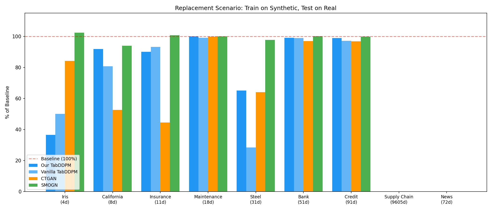
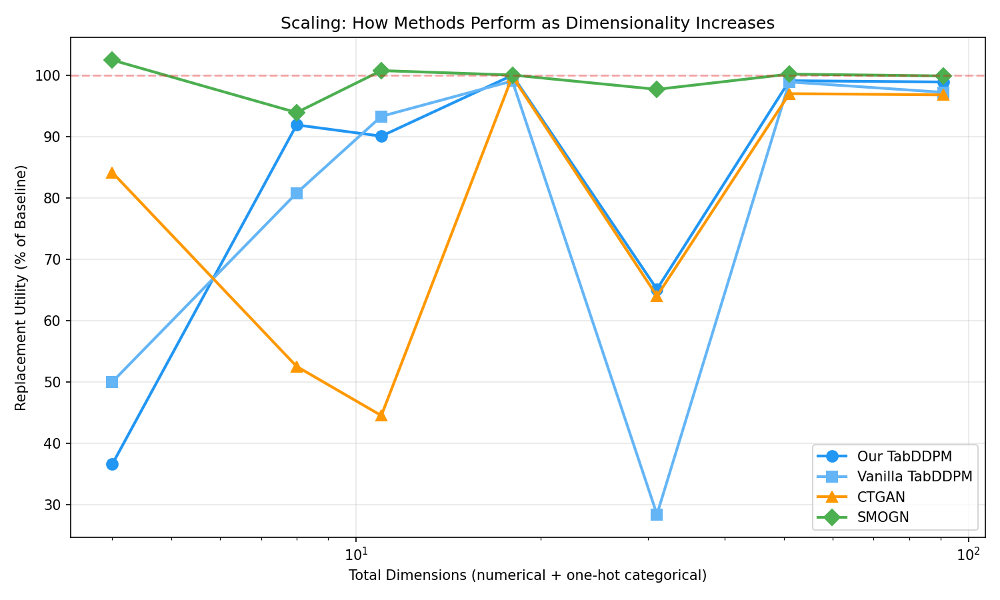
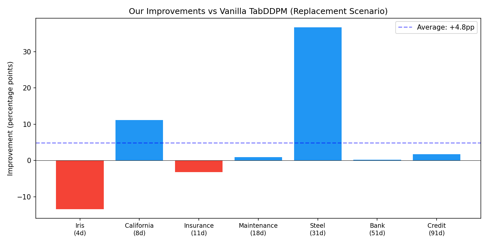
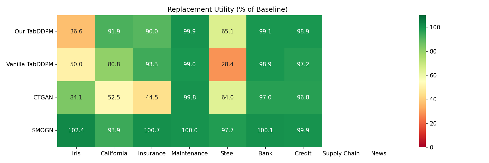
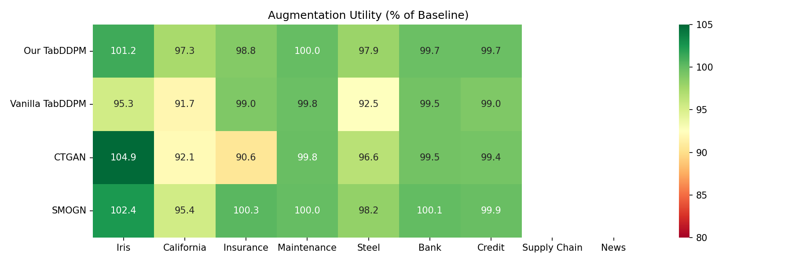

# Phase 2 Experiment Comparison Report

**Experiments:** 30 runs (4 methods × 9 datasets)
**Methods:** Our TabDDPM, Vanilla TabDDPM, CTGAN, SMOGN

## Dataset Overview

| # | Dataset | Samples | Num | Cat | Total Dims | Task |
| --- | --- | --- | --- | --- | --- | --- |
| D1 | Iris | 120+30 | 4 | 0 | 4 | classification |
| D2 | California Housing | 16512+4128 | 8 | 0 | 8 | regression |
| D3 | Insurance Charges | 1070+268 | 3 | 3 | 11 | regression |
| D4 | AI4I Predictive Maintenance | 8000+2000 | 5 | 6 | 18 | classification |
| D5 | Steel Plates Faults | 1552+389 | 24 | 3 | 31 | classification |
| D6 | Bank Marketing | 36168+9043 | 7 | 9 | 51 | classification |
| D7 | Credit Default | 24000+6000 | 14 | 9 | 91 | classification |
| D8 | Supply Chain Pricing | 4958+1240 | 6 | 18 | 9605 | regression |
| D9 | Online News Popularity | 31715+7929 | 44 | 14 | 72 | regression |

---

## Key Findings

**Replacement Scenario Wins:** Our TabDDPM: 0, Vanilla TabDDPM: 0, CTGAN: 0, SMOGN: 7, 

**Average Replacement Utility:**
- Our TabDDPM: **83.1%**
- Vanilla TabDDPM: **78.2%**
- CTGAN: **77.0%**
- SMOGN: **99.2%**

**Average Augmentation Utility:**
- Our TabDDPM: **99.2%**
- Vanilla TabDDPM: **96.7%**
- CTGAN: **97.5%**
- SMOGN: **99.5%**

---

## Utility — Replacement Scenario
*Train on synthetic data only, test on real data. Higher % = better.*

### Replacement (% of Baseline)

| Method | Iris (4d) | California (8d) | Insurance (11d) | Maintenance (18d) | Steel (31d) | Bank (51d) | Credit (91d) | Supply Chain (9605d) | News (72d) | **Avg** |
| --- | --- | --- | --- | --- | --- | --- | --- | --- | --- | --- |
| **Our TabDDPM** | 36.6% | 91.9% | 90.0% | 99.9% | 65.1% | 99.1% | 98.9% | — | — | **83.1%** |
| **Vanilla TabDDPM** | 50.0% | 80.8% | 93.3% | 99.0% | 28.4% | 98.9% | 97.2% | — | — | **78.2%** |
| **CTGAN** | 84.1% | 52.5% | 44.5% | 99.8% | 64.0% | 97.0% | 96.8% | — | — | **77.0%** |
| **SMOGN** | 102.4% | 93.9% | 100.7% | 100.0% | 97.7% | 100.1% | 99.9% | — | — | **99.2%** |
| **Best** | SMOGN | SMOGN | SMOGN | SMOGN | SMOGN | SMOGN | SMOGN | — | — | |

---

## Utility — Augmentation Scenario
*Train on real + synthetic data, test on real data. Higher % = better.*

### Augmentation (% of Baseline)

| Method | Iris (4d) | California (8d) | Insurance (11d) | Maintenance (18d) | Steel (31d) | Bank (51d) | Credit (91d) | Supply Chain (9605d) | News (72d) | **Avg** |
| --- | --- | --- | --- | --- | --- | --- | --- | --- | --- | --- |
| **Our TabDDPM** | 101.2% | 97.3% | 98.8% | 100.0% | 97.9% | 99.7% | 99.7% | — | — | **99.2%** |
| **Vanilla TabDDPM** | 95.3% | 91.7% | 99.0% | 99.8% | 92.5% | 99.5% | 99.0% | — | — | **96.7%** |
| **CTGAN** | 104.9% | 92.1% | 90.6% | 99.8% | 96.6% | 99.5% | 99.4% | — | — | **97.5%** |
| **SMOGN** | 102.4% | 95.4% | 100.3% | 100.0% | 98.2% | 100.1% | 99.9% | — | — | **99.5%** |
| **Best** | CTGAN | Our | SMOGN | SMOGN | SMOGN | SMOGN | SMOGN | — | — | |

---

## Ablation: Our Improvements vs Vanilla TabDDPM
*Shows the impact of MinMaxScaler, outlier clipping, and capacity scaling.*

### Ablation: Our Improvements vs Vanilla TabDDPM

| | Iris (4d) | California (8d) | Insurance (11d) | Maintenance (18d) | Steel (31d) | Bank (51d) | Credit (91d) | Supply Chain (9605d) | News (72d) | **Avg** |
| --- | --- | --- | --- | --- | --- | --- | --- | --- | --- | --- |
| **Our TabDDPM** | 36.6% | 91.9% | 90.0% | 99.9% | 65.1% | 99.1% | 98.9% | — | — | **83.1%** |
| **Vanilla TabDDPM** | 50.0% | 80.8% | 93.3% | 99.0% | 28.4% | 98.9% | 97.2% | — | — | **78.2%** |
| **Improvement** | -13.4% | +11.1% | -3.2% | +0.9% | +36.7% | +0.2% | +1.7% | — | — | **+4.8%** |

---

## Statistical Fidelity (Avg Wasserstein Distance)
*Lower = better distribution match.*

| Method | Iris | California | Insurance | Maintenance | Steel | Bank | Credit | Supply Chain | News |
| --- | --- | --- | --- | --- | --- | --- | --- | --- | --- |
| **Our TabDDPM** | 211.1125 | 0.0838 | 0.0920 | 0.0279 | 82.7348 | 0.5213 | 331.4569 | 51040.4401 | 379.8108 |
| **Vanilla TabDDPM** | 2737.8726 | 6.2512 | 1.0777 | 27.6489 | 1371.6743 | 1.1335 | 410.6809 | — | — |
| **CTGAN** | 0.1655 | 0.0446 | 0.1535 | 0.1255 | 0.1522 | 0.0534 | 0.0362 | — | — |
| **SMOGN** | 0.0865 | 0.2158 | 0.0208 | 0.0086 | 0.0130 | 0.0072 | 0.0050 | — | — |

---

## Figures

